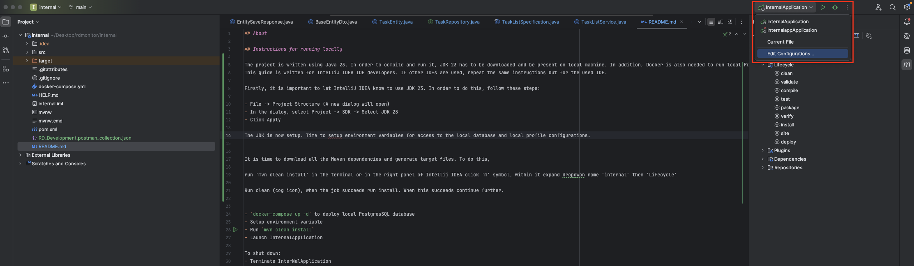
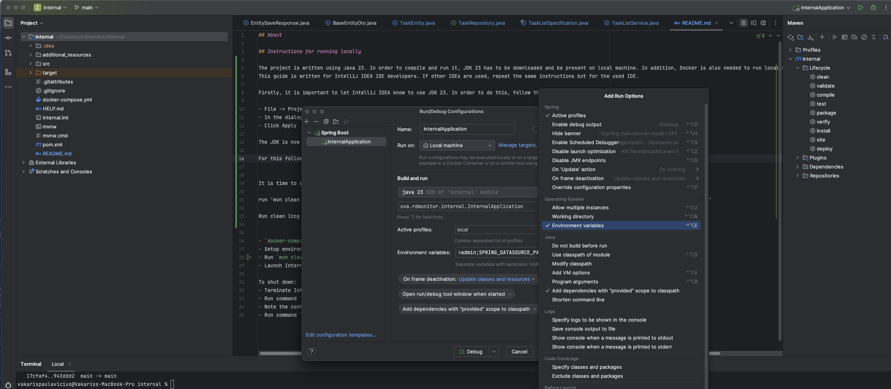
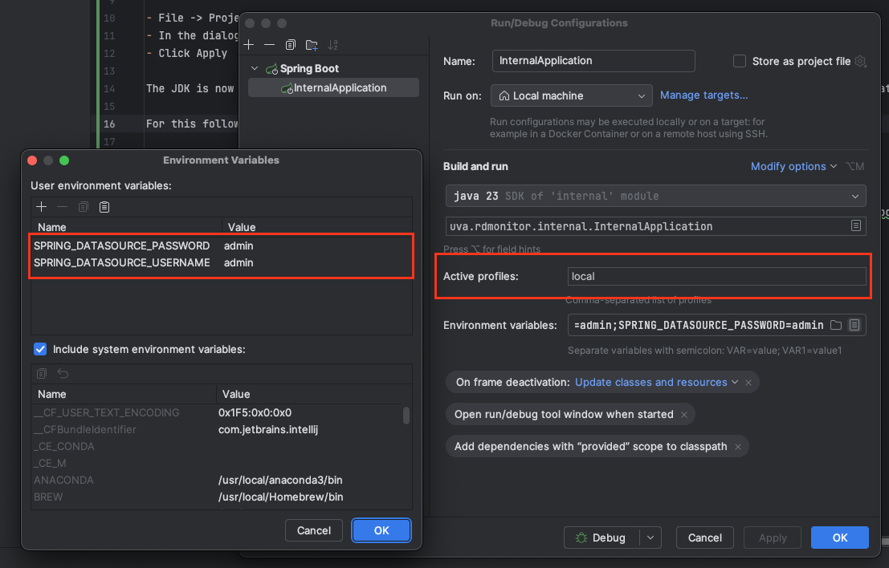

# R&D Development Backend

## About

This project provides the core backend infrastructure for the R&D Development project. It handles API requests and interacts with the main database.

## Prerequisites

- **JDK 23**: Required to compile and run the project.
- **Docker**: Needed to run a local PostgreSQL database.
- **IntelliJ IDEA** (Recommended): The guide below assumes you are using IntelliJ IDEA. If using another IDE, follow equivalent steps.

## Setup Instructions

### 1. Configure IntelliJ IDEA to Use JDK 23

1. Open **File** → **Project Structure** (A new dialog will appear).
2. Navigate to **Project** → **SDK**, then select **JDK 23**.
3. Click **Apply** and **OK**.

### 2. Set Up Environment Variables

1. Open **InternalApplication** → **Edit Configurations**.
2. Click **Modify options** → **Environment variables**.
3. Add the following environment variables:

   ```
   SPRING_DATASOURCE_USERNAME=admin
   SPRING_DATASOURCE_PASSWORD=admin
   ```

   These credentials allow access to the locally Dockerized PostgreSQL database. The `docker-compose.yml` file specifies `admin/admin` as the username and password.

4. Set the profile to **local**. Additional profiles will be configured when setting up CI/CD environments.

#### Reference Images:




### 3. Build the Project

1. Open the terminal and run:
   ```sh
   mvn clean install
   ```
   OR, in IntelliJ IDEA:
    - Open the right panel, click the **Maven (m)** symbol.
    - Expand **internal** → **Lifecycle**.
    - Run **clean** (⚙️ icon), then run **install**.

If successful, proceed to the next step.

### 4. Start the Database and Application

1. Run the following command to start the PostgreSQL database:
   ```sh
   docker-compose up -d
   ```
2. Launch **InternalApplication** from IntelliJ IDEA.

## Testing the API

1. Download the `RD_Development.postman_collection.json` file from the `additional_resources` directory.
2. Import it into [Postman](https://www.postman.com/).
3. Run the **POST** and **GET** requests as examples.
    - Ensure the correct `id` is used for the GET request (e.g., object with `id=1` might not exist).

## Shutdown Instructions

1. Terminate **InternalApplication**.
2. Stop the database container:
   ```sh
   docker ps
   ```
   Identify the container ID or name of the running PostgreSQL instance, then stop it:
   ```sh
   docker stop <container_id_or_name>
   ```

---

## Copyright

**Authors:**  
2025 | University of Amsterdam
